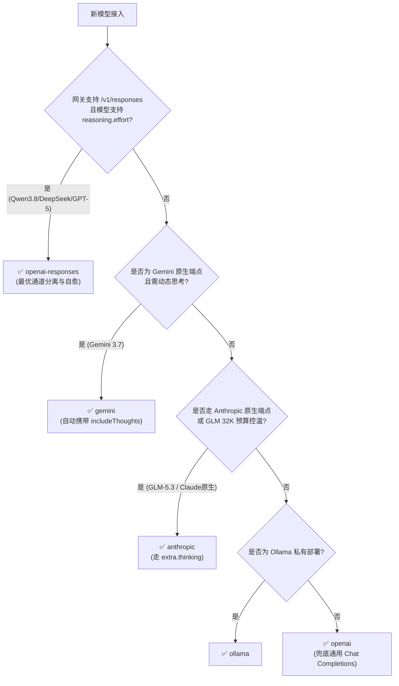

# 模型参数与 apiMode 决策矩阵 (Decision Matrix)

本文档归档 Libiao Copilot 新增/修改内置模型时的参数确定准则、思考档位白名单与 `apiMode` 判定流程，供 `add-builtin-model` 技能按需查阅。

---

## 1. 权威数据源三级检索机制

1. **第一级（必须优先）**：查阅厂商官方技术文档（如 OpenAI、Anthropic、Google DeepMind、阿里云百炼、DeepSeek 等），获取最大上下文 `context_length`、最大输出 `max_tokens`、多模态支持 `vision` 与思考档位。
2. **第二级（官方缺失降级）**：若官网尚未收录，查阅 HuggingFace 官方模型卡片或 OpenRouter 官方模型目录。
3. **第三级（熔断中断）**：若查无确切参数，**严禁凭常理脑补猜测，必须立即中断任务并提醒特哥决策**！

---

## 2. 基础标识规范

- `id`: 必须与 NewAPI 网关路由名称完全一致（如 `deepseek-v4-flash-vision-exp`）。
- `displayName`: **纯文本，严禁手写任何 Emoji**（UI 根据 `vision` 全动态装配）。
- `owned_by`: 内置模型**统一写死为 `"libiaorobot"`**（保证配置面板厂商分组一致）。
- `vision`: `true`（多模态/识图） / `false`（纯文本）。

---

## 3. 上下文与 Token 计算强约束（防截断）

- `context_length`: 官方标称最大上下文长度（如 `1000000` / `1048576`）。
- `max_tokens`: 单次输出上限（取思考模式下最大值，如 `128000` / `384000`）。
- `context_sizes`: **升序梯度数组**（如 `[262144, 524288, 1000000]`）。
  - ⚠️ **强校验**：各项必须 $\le \text{context\_length}$，且**最小档位必须大于 `max_tokens`**（否则可用输入 token 预算会被源码截断为 1）。
- `default_context_size`: 默认选中档位，必须存在于 `context_sizes` 中。

---

## 4. 思考档位 7 档标准枚举白名单

源码 `src/modelConfiguration.ts` 强类型校验仅支持以下 7 个标准值：
$$\text{["auto", "minimal", "low", "medium", "high", "xhigh", "max"]}$$

- `reasoning_effort`: 默认思考档位，必须是 7 档之一。
- `reasoning_efforts`: 允许选择的思考档位列表，各项必须在 7 档内，且必须包含 `reasoning_effort`。
- **避坑**：严禁配置非标档位（如 `off` / `none` / `medium_low`），否则会导致 VS Code 齿轮设置**静默隐藏档位选择器**。

---

## 5. apiMode 四级决策树与思考路由表

按「能力专有度由高到低」顺序依次裁决：

| 接入方式 / 厂商端点 | `apiMode` 取值 | 思考参数写法 | 特殊标志 |
|---|---|---|---|
| 百炼 / DeepSeek Responses 原生端点 | `"openai-responses"` | `"reasoning_effort": "xhigh"`, `"reasoning_efforts": ["low", "medium", "xhigh"]` | DeepSeek 系列须加 `"include_reasoning_in_request": true` |
| Google Gemini 原生端点 | `"gemini"` | `"reasoning_effort": "auto"`, `"reasoning_efforts": ["auto", "low", "medium", "high"]` | — |
| 智谱 GLM / Anthropic 原生端点 | `"anthropic"` | `"extra": { "thinking": { "type": "enabled", "budget_tokens": 32000 } }` | — |
| 本地 / 远程 Ollama 原生端点 | `"ollama"` | — | — |
| 标准 Chat Completions 端点 | `"openai"` | `"reasoning_effort": "high"`, `"reasoning_efforts": ["low", "medium", "high"]` | — |

**决策 3 条强制核验准则**：
1. **Responses 优先**：只要 NewAPI 网关能跑通 `/v1/responses`（如 Qwen 3.8/3.7、DeepSeek V4、GPT-5.x），一律优先选 `openai-responses` 享受权威收敛与自愈。
2. **GLM 走 Anthropic**：智谱 GLM-5.2 / GLM-5.3 走 OpenAI 格式易丢失思考，必须走 `anthropic` + `extra.thinking`（32000 budget）。
3. **Gemini 原生思考**：走 `gemini` 协议时，插件会自动携带 `includeThoughts: true`，防止思考被服务端隐匿扣留。
