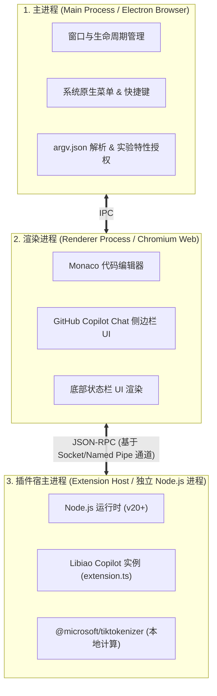
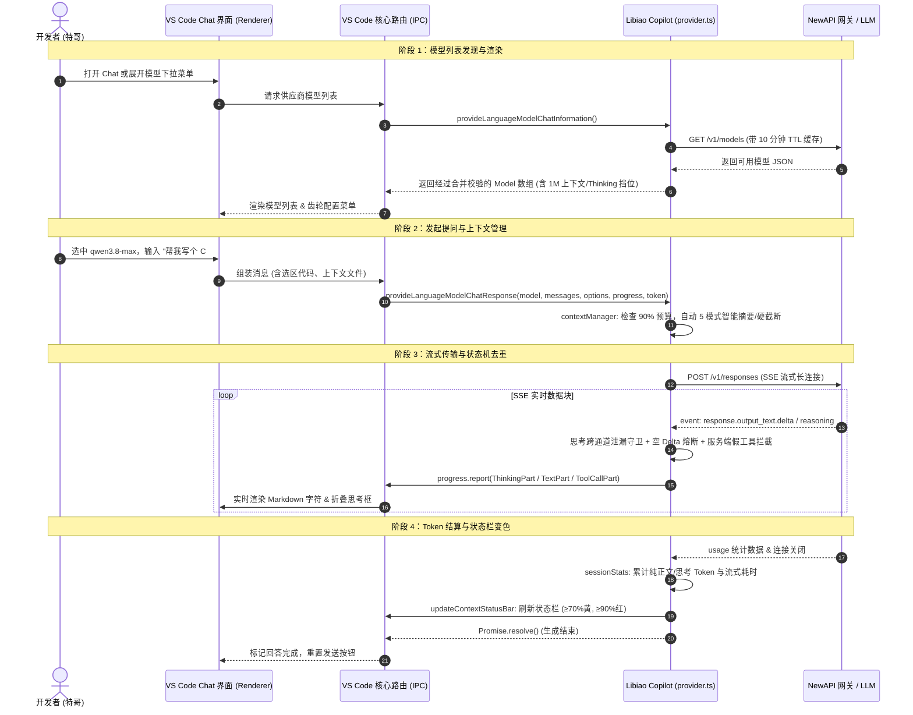
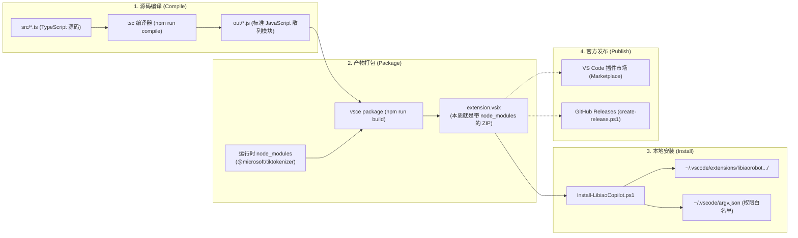
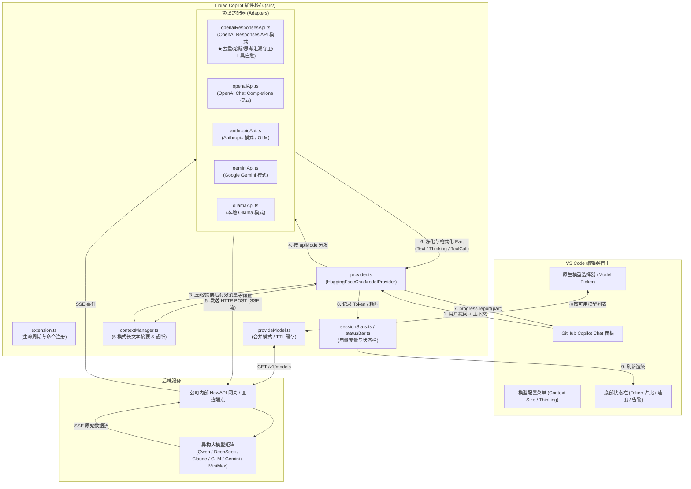

# Libiao Copilot 架构全景与开发者极速上手指南

> **面向读者**：C# / 后端开发者、Vibe Coding 实践者、以及接手此项目的后续维护同学。  
> **核心定位**：将一个从上游 fork、经历深度二次开发的 VS Code AI 模型供应商插件（Extension），用直白、硬核且系统化的技术语言拆解透彻。

---

## 目录
1. [一分钟技术心智对齐（C# 程序员看 VS Code 插件）](#1-一分钟技术心智对齐c-程序员看-vs-code-插件)
2. [VS Code 插件底层加载原理与宿主互动机制](#2-vs-code-插件底层加载原理与宿主互动机制)
   - [2.1 多进程隔离模型（Main vs Renderer vs Extension Host）](#21-多进程隔离模型main-vs-renderer-vs-extension-host)
   - [2.2 插件发现与声明式贡献点（Contribution Points）](#22-插件发现与声明式贡献点contribution-points)
   - [2.3 惰性激活机制（Activation Events）](#23-惰性激活机制activation-events)
   - [2.4 实验性接口机制（Proposed API 与 argv.json 权限注入）](#24-实验性接口机制proposed-api-与-argvjson-权限注入)
   - [2.5 VS Code 与 Libiao Copilot 的端到端互动生命周期](#25-vs-code-与-libiao-copilot-的端到端互动生命周期)
3. [编译、打包、安装与发布全链路底层解析](#3-编译打包安装与发布全链路底层解析)
   - [3.1 编译的本质：TypeScript 源码到 JS 产物（tsc vs C# Roslyn）](#31-编译的本质typescript-源码到-js-产物tsc-vs-c-roslyn)
   - [3.2 打包的本质：VSIX 到底是啥？（VSIX vs NuGet/Zip）](#32-打包的本质vsix-到底是啥vsix-vs-nugetzip)
   - [3.3 本地安装的物理真相与多版本共存陷阱](#33-本地安装的物理真相与多版本共存陷阱)
   - [3.4 发布体系：官方 Marketplace 与 GitHub Release 双轨分发](#34-发布体系官方-marketplace-与-github-release-双轨分发)
4. [项目全景与数据流架构](#4-项目全景与数据流架构)
5. [仓库结构与工程布局](#5-仓库结构与工程布局)
6. [六大核心设计与工作机制](#6-六大核心设计与工作机制)
   - [6.1 模型发现：配置即元数据的合并模式（Merge Mode）](#61-模型发现配置即元数据的合并模式merge-mode)
   - [6.2 多协议适配与请求分发路由](#62-多协议适配与请求分发路由)
   - [6.3 长会话上下文管理（Context Management）](#63-长会话上下文管理context-management)
   - [6.4 流式解析与异构网关抗击打体系（去重、熔断、泄漏守卫）](#64-流式解析与异构网关抗击打体系去重熔断泄漏守卫)
   - [6.5 原生模型配置菜单（Context Size & Thinking Effort）](#65-原生模型配置菜单context-size--thinking-effort)
   - [6.6 状态栏与会话级性能监控（Session Stats）](#66-状态栏与会话级性能监控session-stats)
7. [血泪踩坑与避雷红线（必读）](#7-血泪踩坑与避雷红线必读)
8. [开发者实战 SOP（环境、调试、测试、打包）](#8-开发者实战-sop环境调试测试打包)
9. [常见二次开发任务指引](#9-常见二次开发任务指引)

---

## 1. 一分钟技术心智对齐（C# 程序员看 VS Code 插件）

如果你熟悉 .NET / C#，但从没写过 VS Code 插件或 TypeScript，直接套用以下概念映射即可瞬间理解插件的运行本质：

| .NET / C# 概念 | VS Code Extension / TypeScript 对应物 | 解释与在本项目中的角色 |
|---|---|---|
| **`Program.cs` / DI 容器初始化** | `src/extension.ts` 中的 `activate()` | 插件激活入口，负责注册 Provider、绑定命令、初始化日志与 Tokenizer。 |
| **`IServiceCollection.AddSingleton<T>()`** | `vscode.lm.registerLanguageModelChatProvider()` | 向 VS Code 注册我们自定义的模型供应商（Vendor ID: `libiao-copilot`）。 |
| **`ILanguageModelChatProvider` 接口** | `LanguageModelChatProvider` (TypeScript interface) | `src/provider.ts` 实现了该接口，提供模型列表、Token 计算和流式聊天响应。 |
| **`IAsyncEnumerable<T>` / `Channel<T>`** | `Progress<LanguageModelResponsePart2>.report()` | 流式响应管道。网关每吐一个 SSE chunk，我们就向该管道 `report` 一个文本/思考/工具块。 |
| **`CancellationToken`** | `vscode.CancellationToken` | 用户点击“停止生成”或关闭会话时触发取消，概念与 .NET 完全一致。 |
| **`[RequiresPreviewFeatures]` / 实验特性** | `vscode.proposed.chatProvider.d.ts` (Proposed API) | 微软未完全公开的试验性 API。必须在 VS Code `argv.json` 中声明 `enable-proposed-api` 才能加载。 |
| **DPAPI / `IDataProtectionProvider`** | `vscode.SecretStorage` (`context.secrets`) | 操作系统安全凭据库（Windows 凭据管理器 / macOS Keychain），存放 API Key，绝不明文写 settings.json。 |
| **`IHttpClientFactory` + `HttpClient`** | `fetch` (Node.js 20+ 原生) | 负责向 NewAPI / 模型网关发送 HTTP POST 请求。 |
| **`Polly` 重试策略** | `src/utils.ts` 中的 `executeWithRetry` | 网络抖动或 429 时指数退避重试。 |

---

## 2. VS Code 插件底层加载原理与宿主互动机制

### 2.1 多进程隔离模型（Main vs Renderer vs Extension Host）

VS Code 整体基于 Electron 架构构建，为了保证**任何插件崩溃或死循环都绝不卡死编辑器 UI**，它采用了极其严格的多进程隔离：



* **主进程（Main Process）**：负责管理应用窗口、读取系统级配置（如 `argv.json`）。
* **渲染进程（Renderer Process）**：运行 Monaco Editor 和 Copilot Chat 界面。**它绝不直接执行任何第三方插件代码**，只负责画 UI。
* **插件宿主（Extension Host）**：**我们的 Libiao Copilot 插件唯一运行的地方**。它是一个完全独立的 Node.js 子进程。所有与 VS Code 核心的交互，本质上都是通过 **JSON-RPC 消息管道**跨进程异步通信完成的。

---

### 2.2 插件发现与声明式贡献点（Contribution Points）

当 VS Code 启动时，它**不会**一股脑去执行成百上千个插件的 JS 代码，而是执行**纯声明式的静态扫描**：

1. 遍历扫描安装目录（`~/.vscode/extensions/`）。
2. 读取每个插件的 `package.json` 清单文件。
3. 提取 `contributes` 声明：
   * 在我们的 `package.json` 中，声明了：
     ```json
     "contributes": {
       "languageModelChatProviders": [
         {
           "vendor": "libiao-copilot",
           "displayName": "Libiao Copilot",
           "managementCommand": "libiaoCopilot.setApikey"
         }
       ]
     }
     ```
4. **效果**：此时我们的 JS 代码**一行都没执行**，但 VS Code 渲染进程的 Copilot 模型供应商列表里，已经预先为 `Libiao Copilot` 占好了位置！

---

### 2.3 惰性激活机制（Activation Events）

为了极致的启动速度，VS Code 采用按需激活（Lazy Activation）。

* **激活声明**：`package.json` 中的 `"activationEvents": ["onStartupFinished"]`。
* **触发时机**：当 VS Code 完成编辑器主界面的基础加载后，宿主才会调用 `import("./src/extension.ts")` 并执行 `activate(context)` 函数。
* **挂载服务**：在 `activate()` 中，我们执行 `vscode.lm.registerLanguageModelChatProvider("libiao-copilot", provider)`，将实现了模型接口的 Provider 实例绑定到之前占位的 Vendor 上。

---

### 2.4 实验性接口机制（Proposed API 与 argv.json 权限注入）

`vscode.lm.registerLanguageModelChatProvider`（即 `chatProvider`）是微软 Copilot 生态的**实验性提案接口（Proposed API）**。

* **为什么需要权限控制？** 实验性 API 随时可能变更，微软默认禁止普通本地 VSIX 插件随意调用底层模型路由。
* **双通道白名单机制**：
  1. **已上架商店的插件**：VS Code 根据 Publisher 认证信息走官方白名单直接放行。
  2. **本地测试与内网分发（VSIX）**：必须在 VS Code 全局配置文件 `~/.vscode/argv.json`（或 AppData 下）注入：
     ```json
     {
       "enable-proposed-api": ["libiaorobot.libiao-copilot"]
     }
     ```
  *这也是为什么必须使用我们专属的 `Install-LibiaoCopilot.ps1` 脚本安装的原因——脚本会自动帮你检测并安全写入该配置并重启宿主，否则插件在启动调用 `vscode.lm` 时会直接抛出 `undefined function` 异常崩溃。*

---

### 2.5 VS Code 与 Libiao Copilot 的端到端互动生命周期

当一个开发者在 Copilot Chat 面板敲下回车时，VS Code 核心与 Libiao Copilot 之间会经历以下 6 个严密的 RPC 互动阶段：



---

## 3. 编译、打包、安装与发布全链路底层解析

很多 C# 程序员刚接触 VS Code 插件时，最容易被 `npm`、`tsc`、`vsce`、`VSIX` 这一堆名词绕晕。我们直接用 .NET 的编译发布流水线来做严格对标：



### 3.1 编译的本质：TypeScript 源码到 JS 产物（tsc vs C# Roslyn）

* **C# 的编译**：`csc.exe` / `dotnet build` 将 `*.cs` 编译为 IL 中间语言并打包为 `.dll`。
* **插件的编译**：`tsc`（TypeScript Compiler）将 `src/**/*.ts` 逐个文件翻译为 `out/**/*.js`。
* **特别注意**：
  * 本项目**没有**使用 Webpack 或 Vite 将所有代码混淆打包成一个体积庞大的单文件 bundle，而是**纯散列 JS 模块输出**。
  * `package.json` 中的 `"main": "./out/extension.js"` 指明了入口。Node.js 运行时直接通过 `require("./openai/openaiResponsesApi.js")` 按需加载对应文件。
  * **排查优势**：这极大地方便了线上问题取证。当你去用户的电脑排查插件故障时，直接打开用户的扩展安装目录，就能在 `out/` 文件夹下清晰看到未混淆的 JS 源码和逻辑！

---

### 3.2 打包的本质：VSIX 到底是啥？（VSIX vs NuGet/Zip）

* **VSIX 的物理本质**：`extension.vsix` **本质上就是一个标准的 ZIP 压缩包**！你把它重命名为 `.zip` 解压，就能看到它的内部真实构造：
  ```text
  extension.vsix (ZIP 压缩包)
  └── extension/
      ├── package.json          # 插件元数据与配置 Schema
      ├── out/                  # 编译好的所有 JS 产物
      ├── assets/               # Logo 与静态图标
      └── node_modules/         # 运行时依赖（★ 最关键）
          └── @microsoft/       # 包含我们用来本地算 Token 的 tiktokenizer
  ```
* **打包红线（为什么不能加 `--no-dependencies`）**：
  - VS Code 插件不同于普通 Web 前端（Web 前端所有第三方包都会打入 bundle）。
  - 如果打包命令写了 `--no-dependencies`，`node_modules/` 就不会被装进 VSIX。插件在 VS Code 安装时看似成功，但一启动就会报 `Cannot find module '@microsoft/tiktokenizer'` 并静默崩溃。

---

### 3.3 本地安装的物理真相与多版本共存陷阱

当你在终端运行特哥专属的 `.\scripts\Install-LibiaoCopilot.ps1` 时，后台发生了三件严肃的事情：

1. **解压物理安装**：
   - VS Code 核心将 VSIX 解压到全局扩展目录：
     `C:\Users\<用户名>\.vscode\extensions\libiaorobot.libiao-copilot-<版本号>\`
2. **多版本共存与降级覆盖陷阱（必知！）**：
   - **VS Code 机制**：如果扩展目录下同时存在 `1.0.7` 和 `1.0.6` 两个目录，VS Code 启动时**永远只加载版本号最高的那个（1.0.7）**！
   - **坑点**：如果你由于 Bug 想紧急将版本从 `1.0.7` 回退到 `1.0.6`，普通的 `code --install-extension` 根本不会删除旧的 `1.0.7` 目录，导致新装的 `1.0.6` 被物理架空！
   - **专属脚本的防御**：特哥的 `Install-LibiaoCopilot.ps1` 脚本会在安装前自动扫描并清空旧版本目录，彻底杜绝此类幽灵覆盖。
3. **Proposed API 权限自动注入**：
   - 脚本会自动检查 `~/.vscode/argv.json`，确保包含了 `"enable-proposed-api": ["libiaorobot.libiao-copilot"]`，完成提权。

---

### 3.4 发布体系：官方 Marketplace 与 GitHub Release 双轨分发

我们维护了两种分发渠道：

| 渠道 | 适用场景 | 发布与认证方式 | 用户体验 |
|---|---|---|---|
| **VS Code Marketplace<br/>(官方应用商店)** | 全公司员工、外网用户正式使用 | • Publisher: `libiaorobot`<br/>• 认证: Azure DevOps Personal Access Token (PAT)<br/>• 命令: `npx vsce publish` | 商店一键搜索安装，无需配 `argv.json`，自动静默更新。 |
| **GitHub Releases<br/>(内网 VSIX 手动包)** | 内部灰度测试、离线部署、紧急热更 | • 脚本: `.\scripts\create-release.ps1 -Tag v1.0.x`<br/>• 自动提取 CHANGELOG.md 对应版本生成 Release Note<br/>• 产出: `extension.vsix` + 一键安装批处理 | 双击 `Install-LibiaoCopilot.bat` 一键自动装机与配权限。 |

---

## 4. 项目全景与数据流架构

Libiao Copilot 的核心使命：**作为 GitHub Copilot Chat 与公司内部 NewAPI 网关（及各种大模型）之间的“超级转换桥梁与防弹衣”**。



---

## 5. 仓库结构与工程布局

```text
libiao-copilot/                  ★ 插件主仓库目录（Git 根目录）
├── .github/                     # GitHub 与 Copilot 扩展配置
│   ├── workflows/release.yml    # CI/CD 发布工作流
│   └── skills/                  # ★ Copilot 专属 AI 技能武器库
│       ├── extension-lifecycle/ # 编译、测试、打包与安装技能
│       ├── add-builtin-model/   # 新增与维护内置模型技能
│       ├── stream-diagnostics/  # 流式抓包与日志排障技能
│       ├── model-benchmark/     # 模型性能与 TPS 压测技能
│       └── safe-unicode-edit/   # Emoji 与编码防损技能
├── package.json                 # 插件清单、模型内置元数据、命令、配置项 Schema
├── tsconfig.json                # TypeScript 编译配置
├── assets/                      # 图标、Logo 等资源
├── docs/                        # 插件内置技术文档
│   ├── developer-handbook.md    # ★ 本手册（开发者与架构指南）
│   ├── model-catalog.md         # 内置模型完整目录与参数表
│   └── add-builtin-model.md     # 新增内置模型实操指南
├── scripts/                     # 运维与发布分发工具箱
│   ├── Install-LibiaoCopilot.ps1# ★ 一键安装与配置脚本（自动配 argv.json 与清理缓存）
│   ├── Install-LibiaoCopilot.bat# 双击快捷运行入口
│   ├── create-release.ps1       # GitHub Release 自动化发布脚本
│   └── set-price-notes.js       # 价格/元数据辅助脚本
└── src/                         # 核心源码目录
    ├── extension.ts             # 插件激活入口与命令注册
    ├── provider.ts              # 模型提供者核心分发枢纽
    ├── provideModel.ts          # 模型发现、端点校验、合并模式、TTL 缓存
    ├── provideToken.ts          # Token 计数接口
    ├── modelConfiguration.ts    # 原生菜单 Schema（Context Size、Thinking 挡位）
    ├── modelTester.ts           # TPS 性能测试核心逻辑
    ├── sessionStats.ts          # 会话级 Token 与耗时统计引擎
    ├── statusBar.ts             # 状态栏渲染与 Markdown Tooltip
    ├── contextManager.ts        # 上下文管理编排器
    ├── contextSummarizer.ts     # 上下文摘要器（5 种协议适配）
    ├── contextTrimmer.ts        # 上下文硬截断兜底
    ├── types.ts / utils.ts      # 通用类型定义与工具函数
    ├── logger.ts                # 日志输出（写入 ~/.copilot/libiao-copilot/logs/）
    ├── openai/                  # OpenAI Chat & Responses 协议实现
    ├── anthropic/               # Anthropic 协议实现
    ├── gemini/                  # Gemini 协议实现
    ├── ollama/                  # Ollama 协议实现
    ├── tokenizer/               # Token 计算管理器
    ├── views/                   # Webview 配置界面（configView.ts）
    └── test/                    # 自动化单元测试套件
```

---

## 6. 六大核心设计与工作机制

### 6.1 模型发现：配置即元数据的合并模式（Merge Mode）

*源码位置：`src/provideModel.ts` (`mergeConfiguredModelWithProviders`)*

* **问题背景**：原版插件要么全走配置（无法发现新模型），要么全走 API（上下文死锁在 128k / 4096 输出上限）。
* **合并模式设计**：
  1. **配置充当元数据层**：`package.json` 中的内置模型列表和用户配置的 `libiaoCopilot.models` 提供高级元数据（真实上下文上限如 1M、Thinking 挡位、Vision 支持、API 协议模式等）。
  2. **网关端点真实性核验**：插件按 `baseUrl + apiMode` 将配置模型分组，向各自端点的 `/v1/models` 发起拉取。
  3. **核准才展示（Strict Verification）**：
     - 配置中有，但网关 `/v1/models` 中**没有** $\rightarrow$ 剔除（防止用户选到 404 模型）。
     - 网关 `/v1/models` 有，但配置中**没有** $\rightarrow$ 自动暴露，赋予 128K/4096 默认元数据（零配置即用）。
     - 若网关 URL 错误、Key 错误或网络超时 $\rightarrow$ **绝不兜底显示未经核实的假列表**。
  4. **占位保护（Placeholder）**：如果所有端点均未拉取到模型，返回不可选的占位条目 `__libiao-no-models__`（带 ⚠️ 图标与排错原因）。*这是因为 VS Code 若收到空数组，会把整个 Libiao Copilot 分区在下拉菜单中物理隐藏，导致用户无法发现配置错误*。
  5. **TTL 缓存容灾**：拉取成功的列表缓存 10 分钟（`libiaoCopilot.modelCacheTtlMinutes`）。当网关偶尔抖动时，自动用有效旧缓存顶住。

---

### 6.2 多协议适配与请求分发路由

*源码位置：`src/provider.ts` $\rightarrow$ `src/openai/`, `src/anthropic/`, `src/gemini/`, `src/ollama/`*

不同的模型厂商和网关实现各异，插件通过模型的 `apiMode` 字段进行路由：

```text
model.apiMode 判定:
  ├── "openai-responses" ──> OpenaiResponsesApi (OpenAI 新一代 /v1/responses 协议，Qwen3.8 / DeepSeek-V4 等主力推荐)
  ├── "openai"           ──> OpenaiApi (经典 /v1/chat/completions 协议，GPT / MiniMax / Gemini-OpenAI 兼容模式)
  ├── "anthropic"        ──> AnthropicApi (/v1/messages 协议，Claude 原生 / GLM 模式)
  ├── "gemini"           ──> GeminiApi (Google 原生 generateContent / streamGenerateContent 协议)
  └── "ollama"           ──> OllamaApi (本地 /api/chat 协议)
```

---

### 6.3 长会话上下文管理（Context Management）

*源码位置：`src/contextManager.ts`, `src/contextSummarizer.ts`, `src/contextTrimmer.ts`*

* **残酷现实**：VS Code Copilot 自身**绝不会**主动截断历史消息。随着会话轮数增加，消息总 Token 必然冲破模型上限引发 HTTP 400。
* **双重防御机制**：
  1. **预算设定**：总预算 = $\lfloor \text{ContextSize} \times 0.9 \rfloor$（预留 10% 给 System Prompt 与工具定义）。
  2. **智能摘要压缩（Summarization）**：
     - 当总 Token 超标时，保留系统提示词和最新几轮对话，将其余老消息提取并通过当前模型生成紧凑摘要。
     - 摘要结果以 `System Role` 形式注入，无缝衔接历史。
     - *优化规则*：若需要摘要的老消息 $\le 1$ 条，不触发模型摘要调用（避免浪费 token 与时间），直接静默执行硬截断。
  3. **原子硬截断（Trimmer 兜底）**：若摘要失败或被用户关闭，按整条消息（Message Block）为原子单位从老到新硬截断，确保消息结构完整性。

---

### 6.4 流式解析与异构网关抗击打体系（去重、熔断、泄漏守卫）

*源码位置：`src/openai/openaiResponsesApi.ts`*

在对接 NewAPI 网关与异构大模型（尤其是 Qwen / DeepSeek）时，插件在生产环境遇到了极其隐蔽的流式协议异常，沉淀出四大防御工事：

```text
                      [ SSE 原始数据流 ]
                              │
                              ▼
    ┌────────────────────────────────────────────────────────┐
    │ 1. 思考跨通道泄漏守卫 (runLeakGuard)                    │
    │    • 判定反引号失衡 (思考被拦腰截断)                    │
    │    • 拦截正文通道中残存的思考尾巴和孤儿 </think>         │
    └─────────────────────────┬──────────────────────────────┘
                              │
                              ▼
    ┌────────────────────────────────────────────────────────┐
    │ 2. 服务端工具自愈转换 (handleServerSideToolItem)        │
    │    • 拦截网关自发下发的 file_search / web_search 虚假工具 │
    │    • 转为标准客户端 function_call 并回传错误，引导自愈  │
    └─────────────────────────┬──────────────────────────────┘
                              │
                              ▼
    ┌────────────────────────────────────────────────────────┐
    │ 3. 参数路由污染与单调熔断 (Delta vs Done)                │
    │    • 过滤尾随空 delta，避免 output_text.done 误判重发  │
    │    • Delta 阶段只缓冲不发射，以 Done 事件权威收敛发射   │
    │    • 单调标志位 (_sawTextDelta, _everBufferedThinking) │
    └─────────────────────────┬──────────────────────────────┘
                              │
                              ▼
                  [ 净化后的 Response Part ]
```

1. **空 Delta 尾随重发修复**：
   - *病因*：网关发完所有正文后追加发了一个空内容的 `output_text.delta`，导致旧状态机误判为“从未发送过正文”，随后的 `output_text.done`（全文兜底）把整段回答重发了一遍（UI 出现双倍重复）。
   - *解法*：空 delta 直接丢弃，采用单调置位标志 `_sawTextDelta`，一旦发射过非空 delta 永久熔断 done 重发。
2. **网关 Delta 污染与参数抢跑修复**：
   - *病因*：网关把前一个调用的完整 JSON 参数作为 delta 路由到了下一个 item，旧解析器在 delta 阶段提前 `tryEmit`，导致 UI 弹出两张一模一样的工具卡。
   - *解法*：Delta 分支只累积字符串不抢跑发射，统一收敛到 `output_item.done` 或 `[DONE]` 冲刷时做权威发射。
3. **服务端工具自发调用自愈（Self-Healing）**：
   - *病因*：Qwen 等模型偶发自发调用网关未开放的 `file_search_call` 等服务端工具，导致直接卡死或空响应。
   - *解法*：插件将其拦截并包装为标准函数调用，向模型回传“工具不可用”的标准错误，引导模型在下一轮转用本地真实工具。
4. **思考跨通道泄漏守卫（Leak Guard）**：
   - *病因*：模型把思考的后半段直接吐在正文流中，且尾随一个裸 `</think>`。
   - *解法*：首个正文 chunk 若检测到思考流反引号奇偶失衡，启动缓冲守卫，捕获孤儿标签并回填到折叠思考区。

---

### 6.5 原生模型配置菜单（Context Size & Thinking Effort）

*源码位置：`src/modelConfiguration.ts`*

插件深度集成了 VS Code 原生模型配置面板（在 Copilot Chat 的齿轮菜单中）：
* **Context Size**：提供 256K / 512K / 1M 选项，直接调节输入预算。
* **Thinking Effort**：根据模型元数据中的 `reasoning_efforts` 动态暴露挡位（如 `low` / `medium` / `high` / `xhigh` / `max`），无思考特性的模型自动隐藏该配置项。

---

### 6.6 状态栏与会话级性能监控（Session Stats）

*源码位置：`src/statusBar.ts`, `src/sessionStats.ts`*

* **状态栏图标**：`$(pass-filled) Libiao Copilot 已加载` $\rightarrow$ 请求后显示实时用量进度块。
* **智能变色警报**：
  - 上下文占用 $< 70\%$：正常主题色。
  - 上下文占用 $\ge 70\%$：`$(warning)` 亮黄色预警。
  - 上下文占用 $\ge 90\%$：`$(error)` 亮红色严重告警。
* **真实性能 Tooltip**：摒弃不靠谱的字符转 token 瞬时估算，从网关返回的权威 `TokenUsage` 中提取纯正文与思考 Token，统计窗口生命周期内的总生成量与平均生成速度（Tokens/s）。

---

## 7. 血泪踩坑与避雷红线（必读）

这是特哥与团队踩过的真实大坑，接手或修改代码时**严禁触犯**：

1. 🛑 **版本号与 Git Tag 铁律**：
   - `package.json` 中的 `version` 字段**未经特哥确认绝不得擅自变更**！
   - Git Tag **一律打注解标签**：`git tag -a v1.0.x -m "..."`，严禁打轻量标签。
   - 提交信息必须遵循 Conventional Commits 规范（如 `feat:`、`fix:`、`docs:` 等 + 中文描述）。
2. 🛑 **插件安装唯一法则**：
   - 严禁直接在命令行敲 `code --install-extension`。
   - **必须在仓库根目录执行 `powershell -ExecutionPolicy Bypass -File .\scripts\Install-LibiaoCopilot.ps1`**。该脚本会自动处理 `argv.json` 的 `enable-proposed-api`、清理旧版本残留缓存、检测并禁用上游冲突插件。
3. 🛑 **VSIX 打包依赖红线**：
   - `@microsoft/tiktokenizer` 是运行时依赖。打包时**严禁添加 `--no-dependencies`**，否则生成的 VSIX 会丢失 `node_modules`，安装后在 VS Code 宿主静默报错崩溃。
   - VSIX 产物唯一路径：`libiao-copilot/extension.vsix`（在 `libiao-copilot/` 下跑 `npm run build`）。
4. 🛑 **字符编码与 Emoji 陷阱**：
   - VS Code 自动化工具直接写入 Emoji（如 👁️ / 🖼️）极易变成 `U+FFFD` 乱码。凡涉及 Emoji 的代码与配置文件，一律使用 Unicode 码点转义（如 `\u{1F441}\uFE0F`）。
   - PowerShell 脚本（`Install-LibiaoCopilot.ps1`）必须保存为 **UTF-8 带 BOM** 格式，否则 Windows PS 5.1 会按 GBK 解析导致中文乱码爆炸。
5. 🛑 **测试铁律（“写了测试” $\neq$ “测过”）**：
   - 修改代码后必须真实运行 `npm run compile && npx vscode-test` 并全部 Passing。
   - 若测试用例数量异常，先清空 `libiao-copilot/out/` 目录重新编译，防止旧的编译测试文件残留为“幽灵测试”。

---

## 8. 开发者实战 SOP（环境、调试、测试、打包）

### 8.1 快速搭建开发环境
```powershell
# 1. 确保已安装 Node.js (推荐 v20+)
node -v

# 2. 进入插件工程目录（Git 仓库根目录）
cd libiao-copilot

# 3. 安装依赖
npm install

# 4. 执行编译
npm run compile
```

### 8.2 本地按 F5 调试
1. 在 VS Code 中打开本仓库目录。
2. 按 `F5` 启动调试，选择 **"Extension"** 或 **"Run Extension"**。
3. 会弹出一个全新的 **[Extension Development Host]** VS Code 窗口。
4. 在新窗口中打开 Copilot Chat，选择模型为 `Libiao Copilot` 下的模型即可触发断点。

### 8.3 运行自动化单元测试
```powershell
npm test
# 等价于：npm run compile && npx vscode-test
```
> **注意**：如果当前项目所在路径含有中文或空格，`vscode-test` 可能会出现路径截断。如遇报错，可将编译产物临时复制到无中文路径（如 `D:\LibiaoCopilotTest`）运行测试。

### 8.4 打包与一键安装到本地 VS Code
```powershell
# 1. 在插件工程目录下编译并打包 VSIX
npm run build
# 会生成 extension.vsix

# 2. 运行特哥专属安装脚本
powershell -ExecutionPolicy Bypass -File .\scripts\Install-LibiaoCopilot.ps1
```
安装完成后，完全退出并重启 VS Code 即可生效。

---

## 9. 常见二次开发任务指引

### 任务 A：想新增或修改一个内置模型
1. 打开 `package.json`。
2. 搜索 `libiaoCopilot.models.default`。
3. 按照现有格式添加或修改模型定义：
   ```json
   {
     "id": "qwen3.8-max",
     "name": "Qwen 3.8 Max",
     "owned_by": "alibaba",
     "context_length": 1000000,
     "max_tokens": 128000,
     "apiMode": "openai-responses",
     "vision": true,
     "reasoning_effort": "xhigh",
     "reasoning_efforts": ["low", "medium", "xhigh"]
   }
   ```
4. 如果有自定义的分辨与展现逻辑，同步检查 `src/types.ts` 和 `src/provideModel.ts`。详细图文请参考 [docs/add-builtin-model.md](add-builtin-model.md)。

### 任务 B：想调整某个协议的流式处理逻辑
* 修改 Responses API 流式逻辑 $\rightarrow$ 编辑 `src/openai/openaiResponsesApi.ts`
* 修改 Chat Completions 逻辑 $\rightarrow$ 编辑 `src/openai/openaiApi.ts`
* 修改 Anthropic 逻辑 $\rightarrow$ 编辑 `src/anthropic/anthropicApi.ts`
* 修改 Gemini 逻辑 $\rightarrow$ 编辑 `src/gemini/geminiApi.ts`
* 修改完成后，运行 `npm test` 确保既有 130+ 个测试全部通过。

### 任务 C：排查线上用户报告的流式或生成异常
1. 用户的详细请求日志均会输出在本地文件系统：
   `C:\Users\<用户名>\.copilot\libiao-copilot\logs\`
2. 在 PowerShell 中使用 `Select-String` 搜索关键字（如 `error`、`400`、`required[`、`request.body`、`responses.stream.chunk` 等）可快速复原事故现场。
